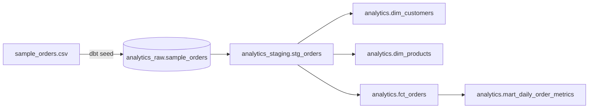

# Customer Orders Pipeline

This is a small batch pipeline that loads the supplied order csv with a dbt seed, models it in PostgreSQL 16, tests the data, and serves daily order metrics. Docker provides the only local prerequisite.



## Run locally

Start PostgreSQL, run the complete dbt DAG, then inspect the mart:

```bash
docker compose up -d --wait postgres
docker compose run --rm --build pipeline
docker compose exec postgres psql -U orders -d orders -c \
  "select * from analytics.mart_daily_order_metrics order by order_date;"
```

Rerun the pipeline with the same command to confirm it is repeatable:

```bash
docker compose run --rm pipeline
```

Stop containers without deleting data, or reset everything including the database volume:

```bash
docker compose down
docker compose down --volumes
```

## View dbt docs locally

After running the pipeline once, generate and serve its documentation:

```bash
docker compose up -d --wait postgres
docker compose run --rm pipeline dbt docs generate
docker compose run --rm -p 127.0.0.1:8080:8080 pipeline \
  dbt docs serve --host 0.0.0.0 --port 8080
```

Open http://localhost:8080. The second command writes the docs to `target/`; the third serves them from a temporary container using the same pipeline image. Press Ctrl+C to stop the docs server. This is a local preview, not a public deployment.

## Models and measures

| Model | Grain |
|---|---|
| `dim_customers` | One row per customer, using attributes from the latest observed order |
| `dim_products` | One row per product, using attributes from the latest observed order |
| `fct_orders` | One row per source order, including cancellations |
| `mart_daily_order_metrics` | One row per order date and currency |

The mart reports order value, not recognized revenue: the source has no payments, refunds, tax, discount, or fulfillment timestamps. `non_cancelled` means every status except `cancelled`. Currency remains in the grain so different currencies are never summed together. Daily distinct-customer counts are not additive across dates.

dbt applies uniqueness, required-field, accepted-value, relationship, non-negative amount, and mart-grain tests. `dbt build` runs seeds, tests, and models in dependency order so invalid upstream data blocks dependent models. It does not make the whole run transactional.

## Design choices

- PostgreSQL 16 runs locally and is also the proposed Cloud SQL engine to avoid SQL dialect drift.
- dbt seed is used for this small static fixture. A recurring production feed would need a real ingestion step before dbt.
- Native customer and product IDs are sufficient for this sample. Dimensions use Type 1, latest-observed attributes with deterministic `order_date`, then `order_id`, ordering.
- Full rebuilds are simpler and reasonable for this level of volume. Ten times the sample would still be too small to justify incremental models.

## Proposed production scheduling and monitoring

In production, Cloud Scheduler would trigger a Cloud Run Job daily. The job would run the same container image used locally and connect to PostgreSQL hosted in Cloud SQL. The Dockerfile and pipeline are reusable unchanged, but the image built locally on Apple Silicon is `linux/arm64` and Cloud Run requires an image containing `linux/amd64`, so publishing an AMD64 or multi-platform build to Artifact Registry is a production prerequisite rather than something this exercise performs.

```text
06:00 UTC Cloud Scheduler
  -> authenticated POST to Cloud Run Jobs :run
  -> runner executes dbt build against Cloud SQL
  -> Cloud Run records the container exit code and JSON completion event
```

Because the proposed cloud architecture uses GCP, monitoring would use Cloud Logging and Cloud Monitoring. Cloud Logging would retain the status and duration events together with dbt output and test failures. Cloud Monitoring would track execution success, run duration, and row counts, and alert on failed jobs, unusually long runs, unexpected row-count changes, or a missing daily completion event.


## Terraform blueprint

`infra/` defines an undeployed Cloud SQL PostgreSQL instance, database, and user. It enables backups, point-in-time recovery, deletion protection, and connector-only access without authorized public networks.

```bash
cd infra
cp terraform.tfvars.example terraform.tfvars
terraform init -backend=false
terraform fmt -check
terraform validate
```

## Production considerations

**10x volume.** For 10x volume, we are talking in the hundred of rows and in that case I would not change one thing. The increase in complexity and dev time will not be worth the optimization gained. For materially larger recurring feeds, I would set up the landing of untouched files in Cloud Storage, load them into a raw schema, make facts/marts incremental, add indexes based on query plans, and consider an analytical warehouse only when PostgreSQL no longer meets the SLA.

**Returns.** Add a separate source and `fct_returns` at the return-event or return-line grain, relate it to the original order/product, and expose refund-adjusted measures without multiplying order totals.

**Junior onboarding.** I would begin with a short walkthrough of the architecture, model grains, and local development workflow. Have the engineer run the pipeline, confirm the expected row counts, and trace a samle order from the seed through staging, the fact and dimension tables, and the daily mart. Pair on a small change—such as adding a data-quality test or metric—then run `dbt build` and review the result, naming, test coverage, and trade-offs together.

**Not implemented for this exercise.** 
SCD2 history, 
concurrent-run locks, 
atomic publication, 
incrementality, 
production alert routing,
disaster recovery

## Assumptions 
Assumptions: 
every row is a complete single-product order; 
`order_amount` is the full order value; the seed is a complete snapshot; 
IDs are stable; 
the four statuses and USD are exhaustive for this fixture; 
repeated customer/product attributes use the latest observation rather than authoritative history.

Questions before productionalization:

- Is delivery a snapshot or increment, and how often does it arrive?
- Can one order contain multiple products or quantities?
- Which statuses count as booked, fulfilled, or recognized revenue?
- Are customer/product changes Type 1 or historically tracked?
- What availability SLA and correction window does reporting require?
- What masking, retention, and access rules apply to customer email addresses?
